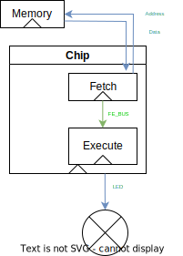

*This Python approach to high level simulation/design is aborded*, it takes too
long to describe the architecture in Python and doing it in Hardware
Description Language (HDL) looks like a better idea.

# Python approach for Cycle Accurate Simulation
Minimalist Sequential Register Transfert Level representation and high level simulation

 - Minimalist: Only the minimum required to model complex circuit's behavior in Python
 - Sequential: Just implement you algorithm with a language you know, no need for combinational overhead.
 - Register transfert level (RTL): You describe the transistion from one clock to an other.

This approach enables you to do functional non-hardware verification in order to experiment and validate micro-architecture.

This is not an hardware description language (HDL) but you should keep in mind the algorithm you describe may be implemented in a HDL at one day and therefore you must keep it as simple and straightfoward as possible.

It results in a clean representation of your design, a functional description, the final medium (FPGA, ASIC using … technology) doesn’t matters this keep representing how the design should behave.

A 1:1 conversion to behavioral VHDL or Verilog is possible (which can sometimes be less restrictive than this Python approach) but I would not recommand it for ASIC or high performance devices unless you really trust your synthesis toolchain and know what you are doing.
## Advanced
Advanced users can add more information in comments, like the expected complexity of the design, the target time delay, clock gating, data gating, clock domain crossing…
## Getting started
Let's say you want to implement the following system:

All blocks with a triangle in this representation are **sequential**, every clock cycle each block will take it's **inputs**, do some logic operation on them and sets its **outputs** before the next clock cycle.
They can also store value locally in order to remember what they did previous clock cycles (called states)

Blocks communicate together using signals (blue) or buses (green). Buses are just collection of signals making is easier to connect big blocks together.

We will implement this system together. If you cannot wait to see the final result it is in [cycle_sim/Getting_started](./Getting_started)

## To do
- [ ] generate verilog/vhdl/new hdl skeleton from python implementation
- [ ] export chronogram – VCD (value changed dump)
- [ ] Force no tab, 4 spaces
- [ ] Parse the python file to check for good clean code
- [ ] raise unimplemented functions
- [ ] use the same print format at gcc so IDEs can parse it easily
- [ ] VCD dump

## Glossary
 - dump, a file containing signal names and how their values change over time
 - [Hardware Description Language (HDL)](https://en.wikipedia.org/wiki/Hardware_description_language), Language used to describe logic circuits like VHDL, Verilog, Chisel, SpinaHDL
 - 
