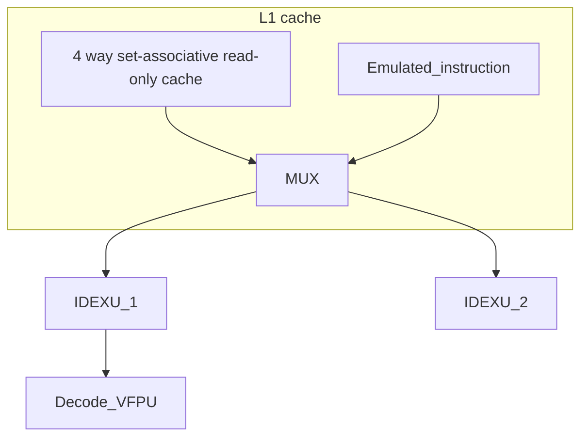

# Verilog hardware model

The hardware description is in [src/](src/)


The documentation for each module is in [doc/README.md](doc/README.md)


The verification for each module is in [verif/](verif/)


## Interactive block diagram



## Status
 - [x] Skywater 130nm toolchain (SKY130)
 - [ ] Add easy to use SKY130 synthesis script
 - [ ] FreePDK15 (or FreePDK45 depending on the cell lib available)
 - [ ] Add easy to use FreePDK45 synthesis script
 - [ ] Add easy to use FreePDK45 synthesis script
 - [x] Dual port block RAM
 - [x] Single port block RAM
 - [.] Instruction cache (L1)
 - [ ] Implement register file
 - [.] Commit instruction to ALU
 - [.] Arithmetic logic unit
 - [ ] MUL/DIV
 - [ ] Commit instruction to FPU 
 - [ ] Floating point division - Shift-and-subtract division algorithm
 - [ ] Floating point division - Sweeney, Robertson and Tocher algorithm
 - [ ] Commit instruction to LSU - Load Store Unit
 - [ ] Load Store Unit
 - [ ] Commit instruction to CMP
 - [ ] CMP
 - [ ] Commit instruction to BRU
 - [ ] BRU
 - [ ] Commit instruciton to DMA
 - [ ] DMA
 - [ ] Multicore cache coherence modeling (High-level)
Write-through VS write back cache. Directory protocol?
 - [ ] Multicore cache coherence implementation - coherence controller (1 per core)
 - [ ] Multicore cache coherence testing
 - [ ] IO bus
 - [ ] GPU/accelerator bus

## TODO: Low priority
 - Improve the Cocotb verification for: Dual port block RAM
 - Improve the Cocotb verification for: Single port block RAM
 - Benchmark: lmbench
 - Benchmark: Spec2017
 - Benchmark: <https://github.com/embench/embench-iot>
 - Add compression in cache
 - If return address prediction can improve C perfomance what about modern
   Oriented Object programing?
 - Profile Guided Optimization (PGO) embedded in the compiler (using the hardware simulation)

## Verilog coding guideline

```
// Only use comments with "//" do not use "/* ... */"
    // Only indent with spaces, no tabulation because of some weird
    // with propriatory tools

module <MODULE'S NAME> (
input wire <INPUT'S NAME>; // always specify "wire"
output wire <INPUT'S NAME>;
);

parameter <PARAMETER'S NAME> = ...; // only use [A-Z_0-9] for constant's names

wire [<SIZE>-1:0] <WIRE'S NAME>; // always use wires

assign <SOME WIRE> = <...>; // use "assign" statements (with blocking '=') for combinational logic

// Instead of using sequential "always" block prefer instanciating a standard Flip-Flop
// Note a_register_name_q has to be a "reg" because it is the output of an instance
// do not use regs otherwise
FF a_register_name (.clk(i_clk), .d(a_register_name_d), .q(a_register_name_q));

// only use combinational "always" block (with blocking '=') if you really know what you are doing and you cannot do it
// cleanly using "generate" blocks

// Stay compliant with IEEE verilog-2005
// Write a testcase using cocotb in verification/<MODULE'S NAME> for every module
// At least check you can synthetise using yosys (default "synth" or AIG)
```
