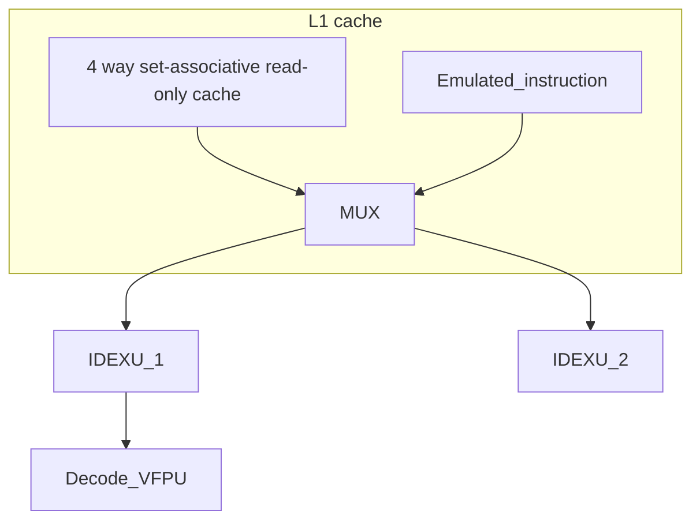

# Verilog hardware model

The hardware description is in [src/](src/)


The documentation for each module is in [doc/README.md](doc/README.md)


The verification for each module is in [verif/](verif/)


## Interactive block diagram



## Status
 - [x] Skywater 130nm toolchain (SKY130)
 - [ ] Add easy to use SKY130 synthesis script
 - [ ] FreePDK15 (or FreePDK45 depending on the cell lib available)
 - [ ] Add easy to use FreePDK45 synthesis script
 - [ ] Add easy to use FreePDK45 synthesis script
 - [x] Dual port block RAM
 - [x] Single port block RAM
 - [.] Instruction cache (L1)
 - [ ] Implement register file
 - [.] Commit instruction to ALU
 - [.] Arithmetic logic unit
 - [ ] MUL/DIV
 - [ ] Commit instruction to FPU 
 - [ ] Floating point division - Shift-and-subtract division algorithm
 - [ ] Floating point division - Sweeney, Robertson and Tocher algorithm
 - [ ] Commit instruction to LSU - Load Store Unit
 - [ ] Load Store Unit
 - [ ] Commit instruction to CMP
 - [ ] CMP
 - [ ] Commit instruction to BRU
 - [ ] BRU
 - [ ] Commit instruciton to DMA
 - [ ] DMA
 - [ ] Multicore cache coherence modeling (High-level)
Write-through VS write back cache. Directory protocol?
 - [ ] Multicore cache coherence implementation - coherence controller (1 per core)
 - [ ] Multicore cache coherence testing
 - [ ] IO bus
 - [ ] GPU/accelerator bus

## TODO: Low priority
 - Improve the Cocotb verification for: Dual port block RAM
 - Improve the Cocotb verification for: Single port block RAM
 - Benchmark: lmbench
 - Benchmark: Spec2017
 - Benchmark: <https://github.com/embench/embench-iot>
 - Add compression in cache
 - If return address prediction can improve C perfomance what about modern
   Oriented Object programing?
 - Profile Guided Optimization (PGO) embedded in the compiler (using the hardware simulation)

## Verilog coding guideline

This guidelines make use of `reg` / `wire` instead of `logic` only because of
the lack of compatibility with opensource EDA (yosys, iverilog, verilator...).
```
// Stay compliant with IEEE verilog-2005

// Only use comments with "//" do not use "/* ... */"
    // Only indent with spaces, no tabulation because of some weird
    // with propriatory tools

module <MODULE'S NAME> #(
parameter <PARAMETER'S NAME> = ... // only use [A-Z_0-9] for constant's names
) (
input wire <INPUT'S NAME>, // always specify "wire"/"reg"
output wire <INPUT'S NAME>
);

wire [<SIZE>-1:0] <WIRE'S NAME>; // use little endian for packed arrays
wire <WIRE'S NAME> [0:<SIZE>-1]; // use big endian for unpacked arrays

// use "assign" statements (with blocking '=') for combinational logic
assign <SOME WIRE> = <...>;

// with systemVerilog we would use always_comb
// if using assign is unpractical use combinational blocks
always@*
begin
    // Only use blocking statements
    a = b; // Such a simple assigment should use "assign"
end

always@*
begin
    // make sure you know what are latches and what you shouldn't do
    if (c[1:0] == 2'b00) d = ...;
    else d = ...; // always set default values
end

always@*
begin
    // with systemVerilog we would use unique case inside
    // do not use casex but you can use casez if you understand priority
    case (select)
        2b'00: e = 1'b0;
        2b'01: e = ...;
        default: e = ...; // set defaults even if not required
    endcase
end

// always name your "generate" statements

assign big_bit_vector[7:0] = {4'b0000, smaller_vector[3:0]}; // be explicit

assign counter[3:0] = 4'(counter_q + 4'b1); // explicitely discard the carry

// Write a testcase using cocotb in verification/<MODULE'S NAME> for every module
// At least check you can synthetise using yosys (default "synth" or AIG)
```

Only standard sequential blocks are allowed, only write your logic in
combinational blocks.

```
always @ (posedge clk)
begin
    if (rst_n == 1'b0) <SIGNAL'S NAME>_q <= 0;
    else <SIGNAL'S NAME>_q <= d;
end
```

```
always @ (posedge clk or negedge async_rst_n)
begin
    if (async_rst_n == 1'b0) <SIGNAL'S NAME>_q <= 0;
    else <SIGNAL'S NAME>_q <= d;
end
```

```
always @ (posedge clk or negedge async_rst_n)
begin
    if (async_rst_n == 1'b0) q <= 0;
    else if (en) q <= d;
end
```
